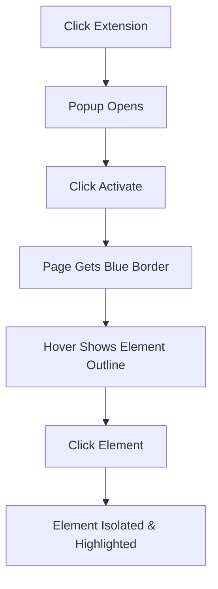

# 🎯 FocusSight (Element Isolator) - Chrome Extension

> **Focus on what matters.** Click any element on a webpage to isolate it and fade out everything else for distraction-free reading and analysis.


## ✨ Features

- **🖱️ One-Click Isolation** - Click any element to focus on it exclusively
- **↩️ Smart Undo** - Restore original layout without losing your place
- **🔄 Auto-Activation** - Remember favorite websites and auto-activate
- **⌨️ Keyboard Shortcuts** - ESC to cancel, intuitive controls
- **🎨 Visual Feedback** - Clear hover effects and activation indicators
- **💾 Memory** - Saves preferences per domain automatically

## 🚀 Quick Start

### Installation

1. **Download** this repository as ZIP or clone it:
   ```bash
   git clone https://github.com/uncogeek/FocusSight.git
   ```

2. **Open Chrome Extensions:**
   - Navigate to `chrome://extensions/`
   - Enable "Developer mode" (top right toggle)

3. **Load Extension:**
   - Click "Load unpacked"
   - Select the extension folder

4. **Pin Extension:**
   - Click the puzzle piece icon in Chrome toolbar
   - Pin "Element Isolator" for easy access

### Usage

1. **Activate** - Click the extension icon and hit "Activate"
2. **Select** - Click any element on the page to isolate it
3. **Undo** - Use the undo button to restore without refresh
4. **Auto-mode** - Toggle on to auto-activate on this website

## 📸 Screenshots

### Screenshot1


### Screenshot2


### Screenshot3


## 🛠️ Technical Details

### File Structure
```
element-isolator/
├── manifest.json          # Extension configuration
├── popup.html            # Extension popup interface
├── popup.js             # Popup logic & settings
├── content.js           # Main functionality
├── content.css          # Styling & animations
├── icons/               # Extension icons
│   ├── icon16.png
│   ├── icon48.png
│   └── icon128.png
└── README.md           # This file
```

### Key Technologies
- **Manifest V3** - Latest Chrome extension format
- **Content Scripts** - DOM manipulation and event handling
- **Chrome Storage API** - Persistent settings per domain
- **CSS Animations** - Smooth hover effects and transitions

### Permissions Used
- `activeTab` - Access current tab content
- `storage` - Save auto-activation preferences

## 🎮 How It Works

### Activation Flow


### Auto-Activation Feature
```javascript
// Automatically activates on saved domains after 2-second delay
async function checkAutoActivate() {
  const domain = window.location.hostname;
  const isEnabled = await chrome.storage.sync.get([`auto_${domain}`]);
  
  if (isEnabled[`auto_${domain}`]) {
    setTimeout(activate, 2000); // 2 second delay for page load
  }
}
```

## 🎯 Use Cases

### 📚 **Reading & Research**
- Focus on article content, hiding ads and distractions
- Isolate specific paragraphs for detailed analysis
- Clean up cluttered documentation pages

### 🎨 **Web Development**
- Inspect individual components without visual noise
- Test element responsiveness in isolation
- Debug layout issues by focusing on problem areas

### 📊 **Data Analysis**
- Isolate tables, charts, or specific data sections
- Focus on form fields during testing
- Highlight important UI elements for screenshots

### 🧠 **Accessibility Testing**
- Test individual elements with screen readers
- Focus on specific interactive components
- Analyze element hierarchy and structure

## ⚙️ Configuration Options

### Popup Controls
| Button | Function | Keyboard |
|--------|----------|----------|
| 🖱️ Activate | Start element selection mode | - |
| ↩️ Undo | Restore without page refresh | - |
| 🔄 Reset | Complete cleanup & refresh | ESC (when active) |

### Auto-Activation Toggle
- **Per-Domain Setting** - Each website remembers separately
- **2-Second Delay** - Waits for page to fully load
- **Visual Indicator** - Shows current domain in popup

## 🔧 Development

### Local Development
```bash
# Clone repository
git clone https://github.com/yourusername/element-isolator.git
cd element-isolator

# Make changes to files
# Load unpacked extension in Chrome for testing
```

### Code Style
- **ES6+ JavaScript** - Modern syntax with async/await
- **CSS Custom Properties** - Maintainable styling
- **Event Delegation** - Efficient event handling
- **Error Handling** - Graceful failure management

### Testing Checklist
- [ ] Activation works on different websites
- [ ] Hover effects respond correctly
- [ ] Element isolation preserves page structure
- [ ] Undo restores exact original state
- [ ] Auto-activation works after page reload
- [ ] ESC key cancels activation
- [ ] Storage persists between sessions

## 🐛 Troubleshooting

### Common Issues

**Extension doesn't activate:**
- Refresh the page and try again
- Check if you're on a valid webpage (not chrome:// pages)
- Look for error messages in browser console (F12)

**Hover effects not working:**
- Ensure you clicked "Activate" first
- Look for blue dashed border around page
- Try clicking the extension icon again

**Undo doesn't work:**
- Use "Reset" button instead for complete cleanup
- Some dynamic pages may need a refresh
- Check console for any JavaScript errors

**Auto-activation not working:**
- Verify toggle is ON in extension popup
- Wait 2+ seconds after page load
- Check domain matches exactly (www. vs non-www)

### Debug Mode
Enable Chrome Developer Tools (F12) and check console for detailed logs:
```
🎯 Element Isolator content script loaded
🚀 Activating...
✅ Activated successfully  
🖱️ Hovering: DIV nav-container
🖱️ Clicked: DIV article-content
🎯 Isolating element: DIV
✅ Element isolated
```

## 📄 License

MIT License - feel free to use, modify, and distribute.

## 🤝 Contributing

1. **Fork** the repository
2. **Create** a feature branch (`git checkout -b amazing-feature`)
3. **Commit** your changes (`git commit -m 'Add amazing feature'`)
4. **Push** to branch (`git push origin amazing-feature`)
5. **Open** a Pull Request

### Feature Ideas
- [ ] Multiple element selection
- [ ] Custom highlight colors
- [ ] Export isolated elements as images
- [ ] Keyboard shortcuts for quick activation
- [ ] Integration with note-taking apps

## 📞 Support

- **Issues:** [GitHub Issues](https://github.com/uncogeek/FocusSight/issues)
- **Questions:** Create a discussion thread

## 🏆 Acknowledgments

- Inspired by web developer tools and reading mode extensions
- Built with modern Chrome Extension APIs (Manifest V3)
- UI design influenced by modern minimalist principles

---

**Made with ❤️ for better web browsing experience**

*Star ⭐ this repository if it helped you focus better!*
